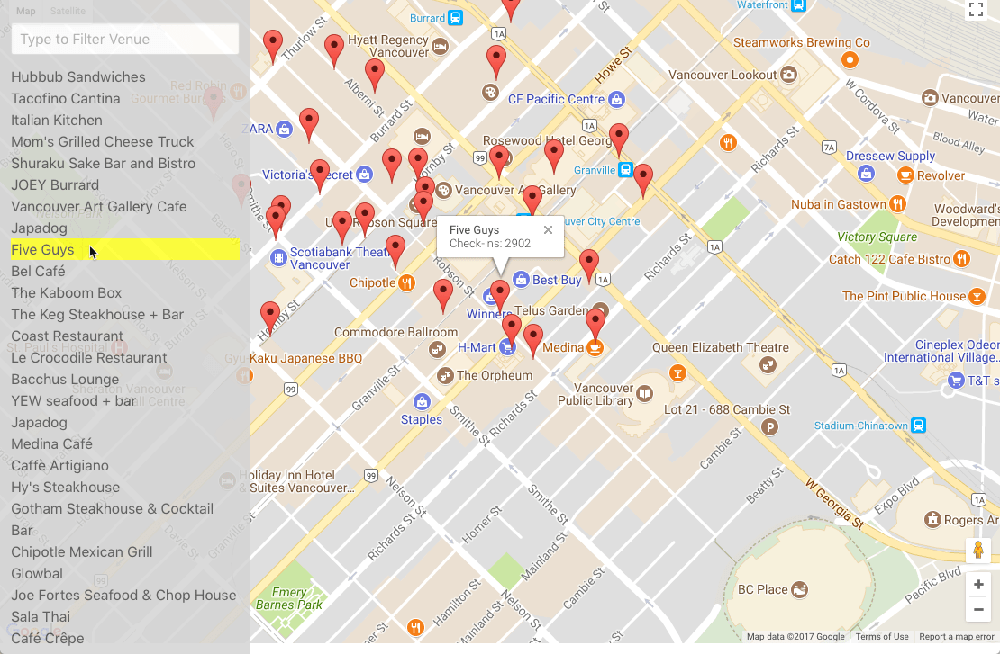

# Neighbourhood Map. (*)
- (*) Please note the 'u'. I'm Canadian. Sorry. :)

## Udacity Project #5 - Responsive JS Google Map & API Mashup
- This shows various points of interest in and around Vancouver
- It pulls in data from the FourSquare API shows the checkin count at each venue
- Mobile responsive
- You can filter responses from the search box or by selecting from the list
- You can also select markers directly
- Uses webpack3 and webpack devServer.
- Uses modern javascript (No self = this headaches)
- Uses Fetch with a polyfill for backward compatibility instead of JQuery .getJSON()

## Installation & Configuration

- Clone this repo
- `yarn install` or `npm install`

## To Run
- DEV: `yarn dev` or `npm run dev` and navigate to `http://localhost:8081/`
- PROD: `yarn watch`